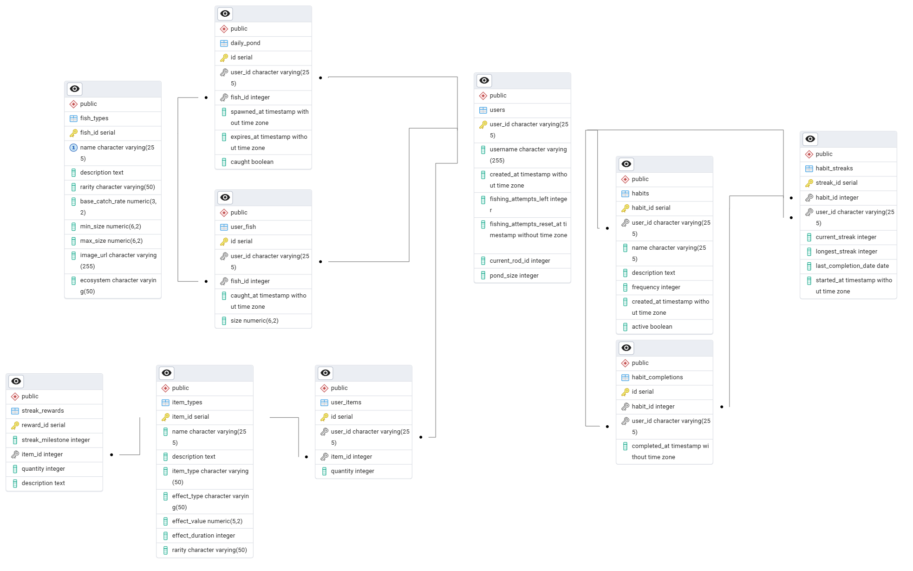

# Fish Habit Game

**TL;DR**: Build positive habits, get cool fish.

---

## What Is This?

This blends habit tracking with a cozy fish-collecting game. Each day:

- New fish appear in your pond.
- You complete habits to earn helpful items.
- You choose when to fish and try catching from the pool.

The better your real-life streaks, the better your chances of landing rare or exotic fish. The vibe is gentle and rewarding missed days mean slower progress, not punishment.

**Inspirations**: Habitica, Animal Crossing, Pokémon, Webfishing, Duolingo.

---

## Daily Game Loop

1. **New Day Begins**
   - Fish pool resets.
   - Habits are reset (unticked).

2. **Complete Habits**
   - Completing a habit grants a random item (e.g., lure, bait).
   - Items boost your chances or reroll the fish pool.

3. **Go Fishing**
   - View daily fish pool.
   - Use items to improve odds (rarity boost, catch chance, etc.).
   - Attempt to catch a fish.
     - If successful, it's added to your inventory and your collection (like a Pokédex).

---

## Target Tech Stack

- **Frontend**: React, TypeScript, Vite
- **Backend**: Python, FastAPI
- **Database**: PostgreSQL
- **DevOps**:
  - GitHub Actions (CI)
  - Automated formatting, linting, and tests

The original Discord bot remains in the repository as historical MVP reference; it is not part of the target application.

## Project Documentation

- [Product vision](docs/product.md)
- [Roadmap](docs/roadmap.md)
- [Architecture](docs/architecture.md)
- [Game rules](docs/game-rules.md)
- [Decision log](docs/decisions.md)

## Development setup

The new web application is organized into two independently runnable projects:

- `backend/`: FastAPI API and Alembic migrations.
- `frontend/`: React, TypeScript, and Vite client.

### Backend

Requires Python 3.12 or later.

```powershell
cd backend
python -m venv .venv
.\.venv\Scripts\python -m pip install -e .
.\.venv\Scripts\python -m uvicorn app.main:app --reload
```

The API is available at `http://localhost:8000`; interactive API documentation is at `/docs`.

### Frontend

Requires Node.js 20.19 or later and pnpm.

```powershell
cd frontend
pnpm install
pnpm dev
```

The frontend is available at `http://localhost:5173` and calls the API at `http://localhost:8000/api/v1` by default.

---

## ERD



---
